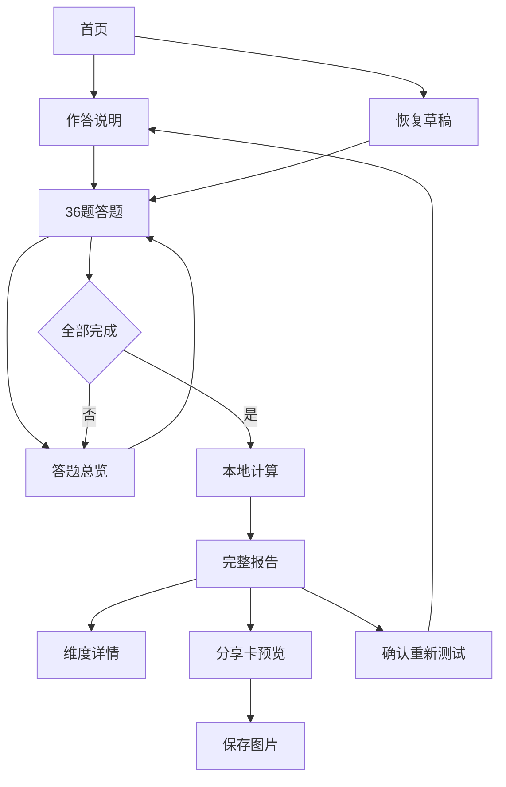

# 七宗罪 × 七美德：完整产品设计与 AI 开发规格

> 版本：1.0 · 36题版 · 2026-09-18  
> 交付性质：可直接用于开发的产品、内容、评分与前端规格。  
> 暂定产品名：**欲望与微光**；商品搜索名称：**七宗罪 × 七美德趣味测试**。  
> 平台：移动端 H5 优先，兼容桌面；默认 Vue 3 + TypeScript + Vite。  
> 本文中的题目、阈值和报告规则是原创娱乐产品设计，未经心理测量学验证，不是标准心理量表。

## 0. 给开发 AI 的执行指令

请完整阅读本文，然后直接实现可运行的前端应用。以本文为唯一业务规则来源，不自行生成题目、不随机生成分数、不接入大模型生成用户报告。题库、评分、报告均使用本地确定性配置。

第一版必须完成首页、说明、36题答题、答题总览、计算过渡、完整报告、维度详情、分享图片与异常恢复。使用下文给出的所有正式文案，禁止 Lorem ipsum、假按钮、待补充占位和假测评进度。按第16节验收后交付源码与启动说明。

开发时建立 `CONTENT_VERSION = 'ssv-36-v1'`。文案、题库或评分任一发生实质变化，均增加内容版本。不要在这版中增添登录、支付、验证码、后台、排行榜或 AI 聊天。未来付费访问通过独立接口接入；纯前端版本不承担防盗链或付费鉴权。

如接入已有工程，优先遵循其包管理器、目录、设计约束与锁文件。新工程使用兼容的稳定依赖组合并锁定版本，勿为了本文升级已有项目。无需依赖外部图片服务，图形使用本地 SVG/CSS，分享图使用 Canvas。

## 1. 产品定位与核心体验

### 1.1 一句话定位

用36次选择，看见驱动你的欲望，以及与你并存的微光。

### 1.2 用户体验目标

- 愿意开始：首屏解释测什么、36题、约5–7分钟、不二次收费。
- 能够完成：单题清晰、进度真实、可返回、可中途恢复。
- 觉得被具体描述：结果说明倾向怎样在生活中表现，并给出一个可尝试的行动。
- 愿意分享：一张精致的竖版档案卡，展现主次特征和14维图谱。
- 不被标签吓到：全程以娱乐自我观察表达，不把“罪”写成道德定罪。

预计时长为产品估计，上线前用试测中位数更新；不得展示虚构测试人数、准确率、科学背书、排名或稀有度。

### 1.3 第一版边界

包含：36题、14维独立得分、七组关系解读、场景个性化、离线完成、结果恢复、图片导出。

不包含：心理疾病筛查、恋爱配对预测、MBTI推算、道德评分、与全网人群比较、账号云同步、在线购买、用户间结果链接。报告内不追加付费解锁，所有14维解析完整可看。

### 1.4 36题结构

| 题号 | 数量 | 作用 |
|---|---:|---|
| Q01–Q28 | 28 | 每个维度两道倾向题，一道正向计分、一道反向计分 |
| Q29–Q35 | 7 | 每题覆盖一组欲望/美德，五个选项同时描述两种倾向；独立计分 |
| Q36 | 1 | 选择报告关注场景，不计分，只影响解读内容和章节顺序 |

合计36题；**35题参与计分，1题选择报告侧重点**。首页说明中如实交代。四种报告侧重点是友情、亲密关系、工作与合作、自我相处。用户选亲密关系不代表其有伴侣；文案不得假定婚恋状态或性别。

每维仅2道倾向题和1道情境观察，信息有限。报告呈现“本次作答的相对倾向”，禁止声称测出稳定人格、潜意识真相或预测行为。

## 2. 世界观与14维定义

视觉主题为“暗夜档案馆”：暖黑背景、金色档案线、莓红欲望、青绿微光，像打开一本记录个人倾向的精装档案。

七宗罪使用通俗名称；七美德使用现代生活化表达。本产品把传统“贞洁”改写为**自持：尊重双方意愿与关系边界**，不评价性经历、性取向或亲密行为的道德高低。内部保留 `chastity` 作为配置ID，前端始终显示“自持”。这是一套本产品的现代改编主题，不宣称宗教定义完全等同。

七组配对仅用于讲述“冲动与应对可以并存”，**不是量表的正反两极**。禁止使用 `美德 = 100 - 罪`；禁止得出“七宗罪总分越低，人越好”。

| 欲望维度 ID / 名称 | 生活化含义 | 微光维度 ID / 名称 | 生活化含义 |
|---|---|---|---|
| pride / 傲慢 | 自己的判断被重视、维护主张 | humility / 谦逊 | 听取不同视角、愿意修正 |
| greed / 贪婪 | 对资源与机会的持续追求 | generosity / 慷慨 | 承受范围内的自愿分享 |
| lust / 色欲 | 心动吸引占据注意力 | chastity / 自持 | 留意双方意愿与关系边界 |
| envy / 嫉妒 | 社会比较带来的失落 | kindness / 友善 | 体谅处境、善意回应 |
| gluttony / 暴食 | 想延长愉悦体验，不限于饮食 | temperance / 节制 | 为享受保留合适范围 |
| wrath / 暴怒 | 被冒犯后的即时反驳冲动 | patience / 耐心 | 容许等待、解释与变化 |
| sloth / 懒惰 | 面对费力任务的启动回避 | diligence / 勤勉 | 把重要目标拆解并持续行动 |

得分高表示这组题描述的倾向出现得更明显，不表示优越或严重。得分低只表示“本次较少认同”，不能推出与之相反的品质。

## 3. 题目呈现与正式题库

### 3.1 统一答题说明

正文：请参考最近一个月通常的自己作答，不必选理想中的答案。遇到不完全适用的情境，请选择更接近你通常反应的一项。没有标准答案，也不需要证明自己是怎样的人。

- Q01–Q28统一五档：1「很不符合」、2「不太符合」、3「介于两者之间」、4「比较符合」、5「很符合」。数字是存储值，界面只展示文案。
- 题序固定，不随机；恢复时完全一致。
- Q01–Q28不展示所属维度和正反向，避免暗示；Q29–Q35只展示题干与选项，不展示计分。
- 情境题选项按JSON数组顺序展示，**不可按ID重新排序**。ID永久标识答案，数组顺序只是展示顺序。
- Q36必须选择一个侧重点，不填姓名、生日、手机号和MBTI。
- 不设置跳过；可以在总览中跳转至任一题补答。总览显示已答数，未答题不可生成报告。

### 3.2 可直接复制的 `questions.json`

下方JSON是题库的唯一权威来源，包含全部36题和情境题评分矩阵。正反向只用于Likert题；情境题使用选项自带的0–4分，不再反转。Q36不参与数值计分。

```json
[
  {
    "id": "Q01",
    "type": "likert",
    "dimension": "pride",
    "reverse": false,
    "text": "我希望自己的判断在团队里得到优先考虑。"
  },
  {
    "id": "Q02",
    "type": "likert",
    "dimension": "generosity",
    "reverse": false,
    "text": "在自己承受得起的范围内，我愿意分享时间或资源。"
  },
  {
    "id": "Q03",
    "type": "likert",
    "dimension": "lust",
    "reverse": false,
    "text": "遇到很有吸引力的人时，我会反复想象和对方靠近的情景。"
  },
  {
    "id": "Q04",
    "type": "likert",
    "dimension": "kindness",
    "reverse": false,
    "text": "即使对方和我没有直接利益关系，我也愿意体谅其处境。"
  },
  {
    "id": "Q05",
    "type": "likert",
    "dimension": "gluttony",
    "reverse": false,
    "text": "遇到很喜欢的娱乐或美食时，我常想再多享受一会儿。"
  },
  {
    "id": "Q06",
    "type": "likert",
    "dimension": "patience",
    "reverse": false,
    "text": "事情推进得慢时，我仍愿意给它一些时间。"
  },
  {
    "id": "Q07",
    "type": "likert",
    "dimension": "sloth",
    "reverse": false,
    "text": "面对费心但该做的事，我常先找点轻松的事情拖一拖。"
  },
  {
    "id": "Q08",
    "type": "likert",
    "dimension": "humility",
    "reverse": false,
    "text": "听到不同意见时，我愿意先找出自己可能遗漏的部分。"
  },
  {
    "id": "Q09",
    "type": "likert",
    "dimension": "greed",
    "reverse": false,
    "text": "已经达到一个小目标后，我很快就会想争取更多。"
  },
  {
    "id": "Q10",
    "type": "likert",
    "dimension": "chastity",
    "reverse": false,
    "text": "与人靠近时，我会确认彼此是否都感到自在。"
  },
  {
    "id": "Q11",
    "type": "likert",
    "dimension": "envy",
    "reverse": false,
    "text": "看到和自己条件相近的人过得更好时，我会有明显的失落。"
  },
  {
    "id": "Q12",
    "type": "likert",
    "dimension": "temperance",
    "reverse": false,
    "text": "享受喜欢的事物时，我会给时间或花费留一个合适的范围。"
  },
  {
    "id": "Q13",
    "type": "likert",
    "dimension": "wrath",
    "reverse": false,
    "text": "觉得自己被冒犯时，我很快就会想反驳回去。"
  },
  {
    "id": "Q14",
    "type": "likert",
    "dimension": "diligence",
    "reverse": false,
    "text": "确定一件对自己重要的事后，我会安排小步骤持续推进。"
  },
  {
    "id": "Q15",
    "type": "likert",
    "dimension": "pride",
    "reverse": true,
    "text": "发现别人更有道理时，我能放下证明自己正确的念头。"
  },
  {
    "id": "Q16",
    "type": "likert",
    "dimension": "generosity",
    "reverse": true,
    "text": "即使付出不会影响自己，我也往往不愿把资源分给别人。"
  },
  {
    "id": "Q17",
    "type": "likert",
    "dimension": "lust",
    "reverse": true,
    "text": "即使对某个人很心动，我的注意力也不容易长时间被牵走。"
  },
  {
    "id": "Q18",
    "type": "likert",
    "dimension": "kindness",
    "reverse": true,
    "text": "面对不熟悉的人的难处，我常觉得没有必要花心思理解。"
  },
  {
    "id": "Q19",
    "type": "likert",
    "dimension": "gluttony",
    "reverse": true,
    "text": "已经获得足够的满足后，我能自然结束眼前的享受。"
  },
  {
    "id": "Q20",
    "type": "likert",
    "dimension": "patience",
    "reverse": true,
    "text": "需要反复解释或等待时，我很容易失去继续投入的意愿。"
  },
  {
    "id": "Q21",
    "type": "likert",
    "dimension": "sloth",
    "reverse": true,
    "text": "即使任务没有趣味，我通常也能在约定时间开始。"
  },
  {
    "id": "Q22",
    "type": "likert",
    "dimension": "humility",
    "reverse": true,
    "text": "别人指出问题时，我常先解释自己为什么没有错。"
  },
  {
    "id": "Q23",
    "type": "likert",
    "dimension": "greed",
    "reverse": true,
    "text": "当手上的资源已经够用时，我能安心停下继续积累。"
  },
  {
    "id": "Q24",
    "type": "likert",
    "dimension": "chastity",
    "reverse": true,
    "text": "为了让关系更快推进，我有时会忽略对方犹豫的信号。"
  },
  {
    "id": "Q25",
    "type": "likert",
    "dimension": "envy",
    "reverse": true,
    "text": "身边的人取得进展时，我通常不会因此怀疑自己的价值。"
  },
  {
    "id": "Q26",
    "type": "likert",
    "dimension": "temperance",
    "reverse": true,
    "text": "一旦享受起来，我常把事先定好的限度放到一边。"
  },
  {
    "id": "Q27",
    "type": "likert",
    "dimension": "wrath",
    "reverse": true,
    "text": "遇到让人生气的事时，我通常能先停一下再回应。"
  },
  {
    "id": "Q28",
    "type": "likert",
    "dimension": "diligence",
    "reverse": true,
    "text": "最初的兴奋过去后，我常把已安排好的行动搁置。"
  },
  {
    "id": "Q29",
    "type": "scenario",
    "dimensions": [
      "pride",
      "humility"
    ],
    "text": "你提出的方案被同伴质疑，对方也拿出了理由。你更接近哪种反应？",
    "options": [
      {
        "id": "A",
        "text": "我很想维护自己的判断，也愿意认真检查对方指出的问题。",
        "scores": {
          "pride": 4,
          "humility": 4
        }
      },
      {
        "id": "B",
        "text": "我很想维护自己的判断，暂时不太想继续听对方分析。",
        "scores": {
          "pride": 4,
          "humility": 0
        }
      },
      {
        "id": "C",
        "text": "我不太在意由谁说了算，也愿意认真检查对方的理由。",
        "scores": {
          "pride": 0,
          "humility": 4
        }
      },
      {
        "id": "D",
        "text": "我不想争论谁对谁错，也暂时不想花心思研究对方的理由。",
        "scores": {
          "pride": 0,
          "humility": 0
        }
      },
      {
        "id": "E",
        "text": "要看事情的重要程度，暂时没有明显倾向。",
        "scores": {
          "pride": 2,
          "humility": 2
        }
      }
    ]
  },
  {
    "id": "Q30",
    "type": "scenario",
    "dimensions": [
      "greed",
      "generosity"
    ],
    "text": "你拿到一份有价值的学习资源，也还有机会争取更多。你更接近哪种想法？",
    "options": [
      {
        "id": "B",
        "text": "我想继续争取更多，也倾向于先把已有资源留给自己。",
        "scores": {
          "greed": 4,
          "generosity": 0
        }
      },
      {
        "id": "C",
        "text": "已有资源暂时够用了，也愿意把允许分享的部分分享出去。",
        "scores": {
          "greed": 0,
          "generosity": 4
        }
      },
      {
        "id": "D",
        "text": "已有资源暂时够用了，也倾向于先把它们留给自己。",
        "scores": {
          "greed": 0,
          "generosity": 0
        }
      },
      {
        "id": "A",
        "text": "我想继续争取更多，也愿意把允许分享的部分分享出去。",
        "scores": {
          "greed": 4,
          "generosity": 4
        }
      },
      {
        "id": "E",
        "text": "要看资源和当时的情况，暂时没有明显倾向。",
        "scores": {
          "greed": 2,
          "generosity": 2
        }
      }
    ]
  },
  {
    "id": "Q31",
    "type": "scenario",
    "dimensions": [
      "lust",
      "chastity"
    ],
    "text": "你遇到一个让你有好感的人，双方还不熟悉。你更接近哪种状态？",
    "options": [
      {
        "id": "C",
        "text": "我没有很强的靠近冲动，但会留意彼此交流是否自在。",
        "scores": {
          "lust": 0,
          "chastity": 4
        }
      },
      {
        "id": "D",
        "text": "我没有很强的靠近冲动，也暂时不会特别留意双方的交流边界。",
        "scores": {
          "lust": 0,
          "chastity": 0
        }
      },
      {
        "id": "A",
        "text": "我很想靠近，也会先确认对方是否愿意继续接触。",
        "scores": {
          "lust": 4,
          "chastity": 4
        }
      },
      {
        "id": "B",
        "text": "我很想靠近，常会先按自己的热情推进，之后才确认对方意愿。",
        "scores": {
          "lust": 4,
          "chastity": 0
        }
      },
      {
        "id": "E",
        "text": "要看相处过程，暂时没有明显倾向。",
        "scores": {
          "lust": 2,
          "chastity": 2
        }
      }
    ]
  },
  {
    "id": "Q32",
    "type": "scenario",
    "dimensions": [
      "envy",
      "kindness"
    ],
    "text": "一位和你起点相近的朋友获得了你也想要的机会，并向你倾诉新压力。你更接近哪种反应？",
    "options": [
      {
        "id": "D",
        "text": "我不太会因差距感到失落，但暂时也没有心思理解对方的难处。",
        "scores": {
          "envy": 0,
          "kindness": 0
        }
      },
      {
        "id": "A",
        "text": "我会因差距感到失落，也愿意认真听对方的难处。",
        "scores": {
          "envy": 4,
          "kindness": 4
        }
      },
      {
        "id": "B",
        "text": "我会因差距感到失落，暂时没有心思理解对方的难处。",
        "scores": {
          "envy": 4,
          "kindness": 0
        }
      },
      {
        "id": "C",
        "text": "我不太会因差距感到失落，也愿意认真听对方的难处。",
        "scores": {
          "envy": 0,
          "kindness": 4
        }
      },
      {
        "id": "E",
        "text": "要看我的状态和彼此关系，暂时没有明显倾向。",
        "scores": {
          "envy": 2,
          "kindness": 2
        }
      }
    ]
  },
  {
    "id": "Q33",
    "type": "scenario",
    "dimensions": [
      "gluttony",
      "temperance"
    ],
    "text": "你正在享受一项喜欢的娱乐活动，而事先安排的结束时间快到了。你更接近哪种状态？",
    "options": [
      {
        "id": "A",
        "text": "我很想再玩一会儿，但通常仍会按原定范围结束。",
        "scores": {
          "gluttony": 4,
          "temperance": 4
        }
      },
      {
        "id": "B",
        "text": "我很想再玩一会儿，也经常会把原定范围往后推。",
        "scores": {
          "gluttony": 4,
          "temperance": 0
        }
      },
      {
        "id": "C",
        "text": "我没有很强的继续冲动，也通常会按原定范围结束。",
        "scores": {
          "gluttony": 0,
          "temperance": 4
        }
      },
      {
        "id": "D",
        "text": "我没有很强的继续冲动，但常随当时情况改变原定范围。",
        "scores": {
          "gluttony": 0,
          "temperance": 0
        }
      },
      {
        "id": "E",
        "text": "要看第二天的安排，暂时没有明显倾向。",
        "scores": {
          "gluttony": 2,
          "temperance": 2
        }
      }
    ]
  },
  {
    "id": "Q34",
    "type": "scenario",
    "dimensions": [
      "wrath",
      "patience"
    ],
    "text": "合作对象的一句话让你觉得被冒犯，对方希望晚一点再解释。你更接近哪种反应？",
    "options": [
      {
        "id": "B",
        "text": "我立刻很想反驳，也不太愿意再等对方解释。",
        "scores": {
          "wrath": 4,
          "patience": 0
        }
      },
      {
        "id": "C",
        "text": "我没有很强的反驳冲动，也愿意留一点时间等对方解释。",
        "scores": {
          "wrath": 0,
          "patience": 4
        }
      },
      {
        "id": "D",
        "text": "我没有很强的反驳冲动，但也不太愿意继续等这件事。",
        "scores": {
          "wrath": 0,
          "patience": 0
        }
      },
      {
        "id": "A",
        "text": "我立刻很想反驳，但仍愿意留一点时间等对方解释。",
        "scores": {
          "wrath": 4,
          "patience": 4
        }
      },
      {
        "id": "E",
        "text": "要看冒犯的内容与当时情况，暂时没有明显倾向。",
        "scores": {
          "wrath": 2,
          "patience": 2
        }
      }
    ]
  },
  {
    "id": "Q35",
    "type": "scenario",
    "dimensions": [
      "sloth",
      "diligence"
    ],
    "text": "你决定开始一件重要但费力的长期任务。你更接近哪种状态？",
    "options": [
      {
        "id": "C",
        "text": "我没有很强的逃避念头，也通常会安排小步骤并逐步执行。",
        "scores": {
          "sloth": 0,
          "diligence": 4
        }
      },
      {
        "id": "D",
        "text": "我没有很强的逃避念头，但也常因没有安排而搁置行动。",
        "scores": {
          "sloth": 0,
          "diligence": 0
        }
      },
      {
        "id": "A",
        "text": "我很想先躲开它，但通常仍会安排小步骤并逐步执行。",
        "scores": {
          "sloth": 4,
          "diligence": 4
        }
      },
      {
        "id": "B",
        "text": "我很想先躲开它，也常把后续行动搁置。",
        "scores": {
          "sloth": 4,
          "diligence": 0
        }
      },
      {
        "id": "E",
        "text": "要看任务和当时精力，暂时没有明显倾向。",
        "scores": {
          "sloth": 2,
          "diligence": 2
        }
      }
    ]
  },
  {
    "id": "Q36",
    "type": "focus",
    "text": "这份报告里，你最想先了解哪个场景中的自己？",
    "options": [
      {
        "id": "friendship",
        "text": "友情｜我怎样与朋友相处"
      },
      {
        "id": "romance",
        "text": "亲密关系｜我怎样靠近与表达"
      },
      {
        "id": "work",
        "text": "工作与合作｜我怎样争取与推进"
      },
      {
        "id": "self",
        "text": "自我相处｜我怎样理解自己的节奏"
      }
    ]
  }
]
```

## 4. 评分规则：确定、透明、可复现

### 4.1 每维分数

Likert原始答案 `v ∈ {1,2,3,4,5}`：正向题 `x=v-1`，反向题 `x=5-v`，均映射到0–4。每维两题得到 `a,b`。该维情境选项得分为 `c ∈ {0,2,4}`。

**维度得分 `score = 10 × (a+b) + 5 × c`。**

倾向题占80%，情境题占20%。14维均有相同的最大分与权重。得分范围0–100、步长10；这些权重是产品约定，不是实证校准值。

例：傲慢Q01选4，反向Q15选2，Q29选A：`a=3,b=3,c=4 → 80分`。如Q29选C，则 `c=0 → 60分`；谦逊按自己的两题和Q29的另一列单独计算。

不得展示“超过80%的人”“80%傲慢”“确诊”“风险等级”；展示“本次倾向 80 / 100”。0分与100分也不代表绝对没有或始终如此。

### 4.2 等级与排序

- 0–30：`较少显现`（level=`low`）。
- 40–60：`情境浮动`（level=`mid`）。
- 70–100：`较为显现`（level=`high`）。

代码按 `<40 / <70 / >=70` 判定，覆盖未来非整十分输入。阈值为娱乐展示分档，不是心理学常模。

罪组与美德组分别按分数降序；完全同分时按第2节固定顺序排序。稳定顺序只用于UI排版，不应伪装成真实的细微差异。并列最高时显示“并列突出”，列出全部最高项。

每组取前2项作为详情快捷入口；对低分组也可显示“本组相对靠前”，不能称为“最强天赋”。排名第1、2差值≤10时定义接近，差值≥20时定义区分较明显。

### 4.3 总览类型（仅三个模板，不制造几十种伪精确人格）

优先级从上到下匹配：

1. 任一组所有维度最大值与最小值之差 `<20`：`mixed`，「多面同行者」。副标题“这次作答里，有些倾向靠得很近，暂不急着用单一标签概括你。”
2. 两组最高分都 `>=70`，且两组第1名减第2名都 `>=20`：`distinct`。标题“{罪主属性} × {美德主属性}”；副标题“你可能既有{罪生活化含义}的一面，也有{美德生活化含义}的一面。”
3. 其他：`contextual`，「随境而动的你」。副标题“不同场景会唤起不同侧面，这次结果里还没有足够清晰的双主属性。”

所有类型都显示完整14维、组内并列项、七组配对和侧重点内容。无明显主属性时，不能强制塞入“某某人格”。当组内最高分并列时，不使用排序后的单个ID生成主属性标题。

### 4.4 作答提示，不评价用户诚信

- Q01–Q28全部选择同一个原始选项：`uniform=true`，温和提示“你在倾向题中使用了相同选项。如果这是你的真实感受，可以保留结果；也可以检查是否有更贴近自己的选择。”
- Likert全部选3且情境题全部选E：`allNeutral=true`，提示“这次很多选择落在中间位置，报告暂不突出单一标签。你仍可查看各维度的含义。”不展示主属性快捷标题。
- 反向计分后的同维两道Likert相差≥3：记录 `contextVariation`，在该维详情显示“你在这组描述中的回答有较大差异，可能需要结合具体情境理解。”不改分、不判无效。
- 不以短时间作答自动判无效，也不显示“系统检测到你撒谎”。
- 提示不阻止看报告或导出；分享卡不展示这些私密提示。

### 4.5 参考计算实现 `scoring.mjs`

下面代码是可执行参考。工程可转换为TypeScript，但不得改变结果语义。调用 `scoreResult(questions, answers)`；answers 为题号→值，Likert用整数，其他题用选项ID。

```javascript
export const PAIRS = [
  ['pride','humility'], ['greed','generosity'], ['lust','chastity'],
  ['envy','kindness'], ['gluttony','temperance'], ['wrath','patience'],
  ['sloth','diligence']
];
export const CONTENT_VERSION = 'ssv-36-v1';
export function scoreResult(questions, answers) {
  const expectedIds = Array.from({length:36},(_,i)=>`Q${String(i+1).padStart(2,'0')}`);
  if (questions.length!==36 || questions.some((q,i)=>q.id!==expectedIds[i]))
    throw new Error('QUESTION_BANK_MISMATCH');
  const ids=PAIRS.flat();
  const bases=Object.fromEntries(ids.map(id=>[id,[]]));
  const scene=Object.fromEntries(ids.map(id=>[id,[]]));
  for (const q of questions) {
    const value=answers[q.id];
    if(q.type==='likert') {
      if(!Number.isInteger(value)||value<1||value>5)
        throw new Error(`INVALID_ANSWER:${q.id}`);
      if(!bases[q.dimension]) throw new Error('UNKNOWN_DIMENSION');
      bases[q.dimension].push(q.reverse ? 5-value : value-1);
    } else if(q.type==='scenario' || q.type==='focus') {
      const option=q.options.find(o=>o.id===value);
      if(!option) throw new Error(`INVALID_ANSWER:${q.id}`);
      if(q.type==='scenario') {
        if(Object.keys(option.scores).length!==2) throw new Error('INVALID_MATRIX');
        for(const id of q.dimensions) {
          const v=option.scores[id];
          if(!scene[id]||![0,2,4].includes(v)) throw new Error('INVALID_MATRIX');
          scene[id].push(v);
        }
      }
    } else throw new Error('UNKNOWN_QUESTION_TYPE');
  }
  const scores={};
  for(const id of ids) {
    if(bases[id].length!==2 || scene[id].length!==1) throw new Error('COVERAGE_MISMATCH');
    scores[id]=10*(bases[id][0]+bases[id][1])+5*scene[id][0];
  }
  const rank=(group)=>group.map((id,index)=>({id,score:scores[id],index}))
    .sort((a,b)=>b.score-a.score||a.index-b.index)
    .map(({id,score})=>({id,score}));
  const sins=rank(PAIRS.map(p=>p[0]));
  const virtues=rank(PAIRS.map(p=>p[1]));
  const span=g=>g[0].score-g[g.length-1].score;
  const clear=g=>g[0].score>=70 && g[0].score-g[1].score>=20;
  const type=span(sins)<20||span(virtues)<20 ? 'mixed'
    :clear(sins)&&clear(virtues) ? 'distinct' : 'contextual';
  const raw=questions.filter(q=>q.type==='likert').map(q=>answers[q.id]);
  const uniform=new Set(raw).size===1;
  const allNeutral=raw.every(v=>v===3) && questions.filter(q=>q.type==='scenario')
    .every(q=>answers[q.id]==='E');
  const level=score=>score<40?'low':score<70?'mid':'high';
  const ties=g=>g.filter(x=>x.score===g[0].score).map(x=>x.id);
  const pairReports=PAIRS.map(([sin,virtue])=>{
    const a=level(scores[sin]), b=level(scores[virtue]);
    return {sin,virtue,state:`${a}_${b}`};
  });
  return {
    contentVersion:CONTENT_VERSION, scores,
    levels:Object.fromEntries(ids.map(id=>[id,level(scores[id])])),
    rankings:{sins,virtues}, topTies:{sins:ties(sins),virtues:ties(virtues)},
    type, focus:answers.Q36, pairReports,
    flags:{uniform,allNeutral,contextVariation:ids.filter(id=>Math.abs(bases[id][0]-bases[id][1])>=3)}
  };
}
```

## 5. 结果内容配置：不调用生成式模型

### 5.1 报告组装顺序

1. 档案编号、完成日期、总览类型、解释性副标题。
2. 必要时显示第4.4节作答提示。
3. 14维总览：两张独立七边雷达图 + 对应数值列表。
4. 当前关注场景：罪组前2项与美德组前2项的场景句；若 `mixed` / `allNeutral`，改为“你可以从下面14个侧面里，挑一个最想了解的部分”，仍提供4个相对靠前项，但标“参考入口”而不是“主属性”。
5. 14维详情列表，按主题固定顺序排列，可点开详情；不要按分数每次改变位置。
6. 七组配对解读，一组一个段落。
7. 两个可尝试的小行动：罪组第一项、美德组第一项的行动句。并列时按固定顺序取用于推荐，并标注“从并列项中选出的两个练习”，不声称最佳。
8. 方法说明、娱乐声明、重新测试和分享入口。

报告标题模板、分档、场景文案和行动句全部来自本文。档案编号单独随机生成，与分数无关：`YYMMDD-XXXX`，XXXX为4位大写随机字母数字，仅作本地展示，不声称全球唯一；报告本地键使用 `crypto.randomUUID()` 或等价安全随机ID。

### 5.2 维度详情模板

每个维度详情包含：名称 + 生活化副标签、得分、等级、解释、当前场景、提醒、一个行动。

- high：使用下方该维的“高分解释”。
- mid：`关于「{生活化副标签}」，你这次的选择呈现出一定情境差异。它可能在部分时候出现，也可能在另一些时候退后。` 接场景引导句。
- low：`你这次较少认同「{生活化副标签}」相关描述。这只表示这一倾向在本次答案中较少显现，不代表你缺少某种品质。` 不直接拼接高分解释。

场景句按等级处理：high直接使用；mid前加“你可以观察：”，low前加“如果你想进一步了解这个维度，可以回想是否出现过这样的时刻：”。低分下它们是自我观察问题，不是断言。

提醒和行动始终可见，标题为“一个可参考的提醒”“可以试试”，不把行动写成治疗或矫正。

### 5.3 全部14维正式文案

下表数据逐项转为 `dimensionContent`，键与第2节ID保持一致。图标使用表内符号含义绘制抽象线性SVG，不依赖Emoji外观。

#### `pride` · 傲慢 / 自我主张

- 图标：王冠；分组：欲望。
- 高分解释：你比较在意自己的判断是否被重视，也愿意为自己的立场发声。
- 提醒：表达立场可以帮助你守住边界，但不必把每次分歧都变成输赢。
- 行动：下一次争论时，先复述对方一个合理的观点，再表达你的意见。
- 友情：你会在意朋友是否尊重你的意见。
- 亲密关系：你希望自己的感受被认真对待。
- 工作与合作：你愿意争取对方案的主导权。
- 自我相处：你对自己有一套不轻易让步的评价标准。

#### `greed` · 贪婪 / 资源追求

- 图标：钥匙；分组：欲望。
- 高分解释：你容易看见下一步还能争取的资源、机会与空间。
- 提醒：追求更多可以带来动力，也可能让已经拥有的东西失去存在感。
- 行动：为一个正在追逐的目标写下“达到什么程度就暂时足够”。
- 友情：你会在意一段友情是否也给自己带来支持。
- 亲密关系：你可能希望关系同时满足多方面期待。
- 工作与合作：你倾向于主动争取更好的机会与回报。
- 自我相处：你容易把满足感放在下一个目标上。

#### `lust` · 色欲 / 心动吸引

- 图标：火花；分组：欲望。
- 高分解释：人际吸引和心动体验比较容易点亮你的注意力。
- 提醒：享受心动时，也可以留意真实相处是否和想象一致。
- 行动：把“让我心动的特点”和“实际相处中的表现”各写两条。
- 友情：你可能对有吸引力、很有个人魅力的人格外关注。
- 亲密关系：心动与靠近的感觉对你很有吸引力。
- 工作与合作：有魅力的合作对象可能更容易吸引你的注意。
- 自我相处：你愿意在想象中体验靠近一个人的可能。

#### `envy` · 嫉妒 / 比较敏感

- 图标：镜面；分组：欲望。
- 高分解释：你比较容易察觉自己与他人的差距，并在意这些差距。
- 提醒：比较有时提醒你想要什么，但别人的进度不等于你的期限。
- 行动：把一次“羡慕别人”改写成一个自己真正想尝试的小行动。
- 友情：朋友之间的进度差异可能牵动你的情绪。
- 亲密关系：你可能留意自己与伴侣身边其他人的比较。
- 工作与合作：同事的认可和机会分配可能让你格外敏感。
- 自我相处：他人的进展容易成为你审视自己的参照。

#### `gluttony` · 暴食 / 享受延续

- 图标：盛杯；分组：欲望。
- 高分解释：愉快体验容易让你想延长当下，多停留一会儿。
- 提醒：享受本身不需要被责备，关键是结束后是否仍然舒服。
- 行动：开始一段娱乐前，先选一个自然的结束点，例如一集或一轮。
- 友情：和朋友相聚的快乐可能让你不想散场。
- 亲密关系：你可能喜欢反复延长两个人相处的甜蜜时刻。
- 工作与合作：短暂休息中的娱乐可能让你舍不得回到任务。
- 自我相处：你容易通过喜欢的体验给自己即时奖励。

#### `wrath` · 暴怒 / 冲突反应

- 图标：闪电；分组：欲望。
- 高分解释：受到冒犯或遇到不公时，你的反应可能来得比较快。
- 提醒：这股反应能提示边界受到触碰，也值得给表达留一点缓冲。
- 行动：在发出带情绪的消息前，先把诉求改写成一句具体请求。
- 友情：朋友的无心之言也可能迅速碰到你的在意之处。
- 亲密关系：争执时，你可能很想立刻把委屈说明白。
- 工作与合作：不公平的安排可能使你迅速进入反驳状态。
- 自我相处：你对不舒服的体验比较容易出现即时反应。

#### `sloth` · 懒惰 / 启动回避

- 图标：月影；分组：欲望。
- 高分解释：面对费力的任务，你可能更需要启动的理由与缓冲空间。
- 提醒：暂时想躲开任务不等于没有能力；可以把启动成本再降一点。
- 行动：把最难开始的一件事缩成一个两分钟内能完成的动作。
- 友情：需要主动安排的聚会可能被你一再推迟。
- 亲密关系：你可能推迟一场知道需要进行的认真沟通。
- 工作与合作：复杂或反馈慢的任务容易让你迟迟难以开头。
- 自我相处：你有时用轻松的小事缓冲面对难题的压力。

#### `humility` · 谦逊 / 开放修正

- 图标：麦穗；分组：微光。
- 高分解释：你愿意给不同视角留空间，也愿意修正原来的判断。
- 提醒：开放并不要求你放弃自己的立场；你也可以明确说出不同意。
- 行动：听取建议后，分别写下“我接受的部分”和“我保留的部分”。
- 友情：你愿意让朋友指出你没看见的角度。
- 亲密关系：你比较愿意承认自己在关系中也有看漏的地方。
- 工作与合作：反馈能帮助你迭代方案，而不只是证明表现好坏。
- 自我相处：你允许自己的认识随着经历发生变化。

#### `generosity` · 慷慨 / 自愿分享

- 图标：掌心；分组：微光。
- 高分解释：在可以承受的范围内，你愿意为别人腾出资源与时间。
- 提醒：分享可以出于愿意，而不是出于担心拒绝后被讨厌。
- 行动：下一次答应帮忙前，先明确你能提供的范围和时间。
- 友情：你愿意在朋友需要时提供具体支持。
- 亲密关系：你可能通过投入时间和精力表达在意。
- 工作与合作：你愿意分享信息，帮助合作推进。
- 自我相处：你可以同时保留照顾自己和帮助别人的空间。

#### `chastity` · 自持 / 关系边界

- 图标：银环；分组：微光。
- 高分解释：你会留意靠近的节奏、彼此的意愿和关系中的边界。
- 提醒：尊重边界与表达喜欢可以同时发生，不必靠猜测完成沟通。
- 行动：把一个模糊的期待改成直接但允许拒绝的询问。
- 友情：你会留意玩笑、联系频率和私人空间是否合适。
- 亲密关系：你重视靠近是否出于双方自愿，也愿意明确沟通。
- 工作与合作：你会区分合作需要和他人的私人边界。
- 自我相处：你愿意辨认“我想要”和“我愿意接受”之间的区别。

#### `kindness` · 友善 / 善意回应

- 图标：枝叶；分组：微光。
- 高分解释：你愿意在判断一个人之前，多留意对方所处的情境。
- 提醒：理解别人不等于替别人承担所有后果。
- 行动：在表达理解之后，再说清楚自己能够提供什么帮助。
- 友情：你愿意先理解朋友行为背后的处境。
- 亲密关系：你会关心伴侣当时的感受与困难。
- 工作与合作：你愿意给同事的失误留出解释与改进的空间。
- 自我相处：你可以尝试把对别人的体谅也分一点给自己。

#### `temperance` · 节制 / 适度选择

- 图标：刻度；分组：微光。
- 高分解释：你比较愿意为喜欢的事留出适合自己的范围与节奏。
- 提醒：适度不等于事事克制，计划里也可以留出随兴的余地。
- 行动：给一个常做的娱乐安排一个可调整的范围，而非苛刻禁令。
- 友情：你会平衡相聚的快乐和自己的休息需求。
- 亲密关系：你可能希望亲密与个人生活保持合适节奏。
- 工作与合作：你愿意安排工作、休息与即时奖励之间的比例。
- 自我相处：你会思考一种享受是否适合长期维持。

#### `patience` · 耐心 / 等待空间

- 图标：沙漏；分组：微光。
- 高分解释：你愿意让进展、理解与改变拥有一定的时间。
- 提醒：耐心可以与期限并存，不必无限等待一个没有回应的承诺。
- 行动：为一件正在等待的事设一个重新评估的时间点。
- 友情：你愿意给朋友慢慢表达和回复的空间。
- 亲密关系：你能接受关系中的一些问题需要多次沟通。
- 工作与合作：你愿意持续推进反馈较慢的合作。
- 自我相处：你能够允许自己的变化不是立刻发生。

#### `diligence` · 勤勉 / 持续行动

- 图标：星轨；分组：微光。
- 高分解释：你愿意把在意的目标拆成行动，并持续为它留出时间。
- 提醒：持续行动也需要恢复精力，休息不是对努力的否定。
- 行动：为正在推进的目标，同时安排一个最小行动和一个休息点。
- 友情：你愿意用持续联系和实际安排维护友情。
- 亲密关系：你会通过日常行动兑现关系中的承诺。
- 工作与合作：你倾向于把目标拆解后稳定推进。
- 自我相处：你愿意用重复的小行动积累变化。

### 5.4 七组配对：9种状态通用模板

使用 `pairReports.state` 选择下面模板，替换 `{S}` 为欲望生活化副标签，`{V}` 为美德生活化副标签。每组再追加对应的“关系句”，7组全部渲染；不需要人工编写49种跨组组合。

| state | 正式模板 |
|---|---|
| high_high | 你这次同时较多认同「{S}」与「{V}」。一种感受和一种应对方式可以同时存在，并不互相抵消。 |
| high_mid | 「{S}」在本次答案中较为显现，而「{V}」更随情境变化。你可以留意两者在什么情况下同时出现。 |
| high_low | 「{S}」较为显现，「{V}」在本次答案中较少显现。这不是好坏判断，可以从具体相处情境里进一步观察。 |
| mid_high | 「{S}」随情境浮动，而「{V}」较为显现。你可能会在不同感受之间，保留一种比较常用的应对方式。 |
| mid_mid | 「{S}」与「{V}」都处在情境浮动区。单一标签不太能概括这组回答，可以把注意力放在具体场景。 |
| mid_low | 「{S}」随情境浮动，「{V}」较少显现。这组答案没有必要被解读成固定的行为方式。 |
| low_high | 「{S}」较少显现，「{V}」较为显现。请把它理解为本次的回答倾向，而不是对所有场景的承诺。 |
| low_mid | 「{S}」较少显现，「{V}」随情境浮动。你可以继续观察，什么情况下会更明显地感受到其中一面。 |
| low_low | 本次你对「{S}」和「{V}」的相关描述都较少认同。这不表示空白或缺陷，也可能是题目没有覆盖你常见的状态。 |

每组关系句：

| 配对 | 关系句 |
|---|---|
| 傲慢 × 谦逊 | 坚持自己的判断，与愿意修正判断，可以发生在同一个人身上。 |
| 贪婪 × 慷慨 | 想拥有更多，与愿意分享已有的东西，不必互相排斥。 |
| 色欲 × 自持 | 心动可以很强烈，靠近的节奏仍然可以由双方共同确认。 |
| 嫉妒 × 友善 | 因比较而失落，并不妨碍你体谅另一个人的难处。 |
| 暴食 × 节制 | 想继续享受，与选择在合适的时候停下，是两个不同侧面。 |
| 暴怒 × 耐心 | 有即时的反驳冲动，也可以选择给解释留一点时间。 |
| 懒惰 × 勤勉 | 想逃开一件费力的事，也仍然可能通过小步骤推进它。 |

### 5.5 明确禁止的结果话术

禁止：你天生冷血、你注定出轨、你有某种障碍、你的人格很危险、你的罪恶值、人格纯度、你超过全国X%的人、只有1%的人拥有、科学准确率99%、某MBTI一定对应某罪。

可用：本次作答、你可能、较为显现、可供观察、在某些情境中。不要每句机械堆叠“可能”，高分解释可正常直述，但在报告首屏说明测量边界。

## 6. 信息架构、路由与状态流

| 路由/层级 | 页面 | 必须实现 |
|---|---|---|
| `/` | 首页 | 主题、价值说明、样例图、开始/继续、说明入口 |
| `/intro` | 开始说明 | 36题结构、作答参考、设备保存提醒、进入答题 |
| `/quiz/:index` | 答题页 | 单题、真实进度、上一题/下一题、总览、离开恢复 |
| 弹层 | 答题总览 | 36题状态网格，点击跳转，未答提示 |
| `/processing` | 计算过渡 | 本地计算状态，无伪装后台AI |
| `/report/:id` | 报告页 | 完整报告、切换关注场景、维度入口、导出 |
| 报告底部抽屉 | 维度详情 | 对应维度完整解析与关闭 |
| `/share/:id` | 分享预览 | 两种配色、卡片预览、导出状态与失败降级 |
| `/about` | 方法与隐私说明 | 规则概述、娱乐声明、本地数据、清除数据 |
| 任意无效路由 | 友好错误页 | 返回首页 |

`index` 为1–36整数；无效值重定向到首个未答题或Q36。没有草稿直接访问答题页，先进入说明页。无报告访问报告/分享页显示“这份档案暂时不在当前设备里”，提供首页和已有草稿继续入口。不要白屏或伪造报告。



状态模型：`idle → answering → calculating → completed`；错误作为局部状态保留原答案，不能因为渲染或导出失败重置答题。报告创建使用草稿ID作幂等键，连点完成不能产生多个报告。

## 7. 视觉系统：暗夜档案馆

### 7.1 颜色变量

```css
:root {
  --bg: #121116;
  --surface: #1D1B23;
  --surface-raised: #28242F;
  --text: #F5EFE4;
  --text-secondary: #C2B9C6;
  --text-muted: #A79CAD;
  --gold: #E8C88C;
  --gold-ink: #241D14;
  --sin: #EF9EA9;
  --virtue: #91D3BD;
  --border: #49414F;
  --focus: #F2DDAE;
  --danger: #FFADA8;
  --selected-bg: #342C26;
  --selected-border: #E8C88C;
  --chart-grid: #625768;
  --paper: #F7F1E8;
  --paper-ink: #302A32;
  --paper-sin: #9A3F55;
  --paper-virtue: #246B59;
}
```

正文背景使用 `--bg` 或 `--surface`；正文不要叠在图片或渐变高亮处。金色只用于主按钮、档案线、关键数字；粉色代表欲望，青绿代表微光；错误态用独立错误图标+文字，不仅依靠红色。雷达面填充透明度0.14，线条不透明。

浅色仅用于第二款分享卡，不增加全站主题切换。夜色分享卡用上述主色，纸感分享卡用paper色系。

### 7.2 字体与尺寸

- 中文正文：`-apple-system, BlinkMacSystemFont, "PingFang SC", "Microsoft YaHei", sans-serif`。
- 标题可用系统宋体：`"Songti SC", "Noto Serif CJK SC", "SimSun", serif`，本地缺失时正常回退；不从第三方加载字体。
- 首页主标题32px/1.35，报告标题28px/1.4，章节标题22px/1.45，题干22px/1.55，选项16px/1.55，正文15px/1.75，辅助文字13px/1.6。
- 320px宽时题干20px；字号不因为文字长而缩到16px以下。
- 数字可使用系统等宽字体，进度和分数启用 `font-variant-numeric: tabular-nums`。

### 7.3 间距、圆角、布局

- 基础间距：4/8/12/16/24/32/48px。
- 页面左右内边距20px（320px宽为16px）。
- 答题容器最大宽520px；首页/报告最大宽760px；桌面雷达可两列，手机上下排列。
- 卡片圆角20px，按钮14px，选项16px，底部抽屉上角24px。
- 主按钮高52px，触摸目标至少44×44px；选项最小60px，长文自然撑开。
- 顶部44–56px导航 + 安全区；底部固定操作条高76px + 安全区。正文增加等高padding，不被遮挡。
- 不使用全屏固定高度容纳全部内容；使用 `min-height:100dvh` 并提供 `100vh` 回退；键盘或横屏时允许自然滚动。
- 无重阴影、无玻璃磨砂叠层；卡片通过底色和1px边框区分。

### 7.4 图形资产

首页：一个直径220px的装饰圆环，左半莓红细线、右半青绿细线，中心金色小星，外圈7组短刻度。它只是品牌装饰，不显示假数据。

14个图标均用24×24 viewBox、1.5px描边、本地SVG；欲望和微光使用同一视觉线宽。线性象征见第5.3节，不使用骷髅、血液、惩罚、色情图案。

首页样例雷达必须标注“报告样例 · 非你的结果”，样例分数固定，不混入真实计算状态。

## 8. 逐页前端设计

### 8.1 首页 `/`

从上至下：

1. 顶栏：左侧星环图标 +「欲望与微光」，右侧「测评说明」。
2. Hero上眉：`SEVEN SINS × SEVEN VIRTUES`，12px字距2px，作为装饰但保证中文标题完整表达信息。
3. 主标题两行：“你的欲望里，／也藏着微光。”
4. 副标题：“七宗罪 × 七美德趣味测试。看看驱动你的念头，与陪伴你的另一面。”
5. 中央星环装饰；禁用持续旋转。
6. 信息行：“36道选择 · 约5–7分钟 · 完整报告”。
7. 主按钮：“开始探索”；有兼容草稿时改为“继续探索 · 已完成{n}/36”，下方次按钮“重新开始”。
8. 三个价值卡，文案分别“14维倾向图谱”“日常场景解读”“专属分享卡片”，各一行说明。
9. 报告样例：缩略双雷达与两项解读，清楚标样例。
10. 常见问题3项折叠：多久完成？结果说明什么？答案保存在哪里？答案来自本文，不声称科学诊断。
11. 页脚：“娱乐性自我观察，不作心理诊断或道德评判。”

若已完成报告且没有草稿，主按钮仍是开始探索，增加“查看上次报告”。若同时有草稿与旧报告，主按钮优先继续草稿，旧报告入口保留。

### 8.2 说明页 `/intro`

标题“先把理想答案放一边”。正文使用第3.1节说明。三条提示：

- 28道倾向题 + 7道情境题 + 1道报告侧重点选择。
- 按最近一个月通常的感受选择，可随时返回修改。
- 答案保存在当前浏览器，清理浏览器数据后可能无法恢复。

底部常显短说明“这是一份趣味探索，不是专业心理评估”。按钮“我准备好了”。点击后创建草稿；不是点击首页时就创建。无需额外勾选营销授权。

### 8.3 答题页 `/quiz/:index`

顶部：返回按钮；中间“欲望与微光”；右侧“总览”。下一行：`第{index}题 / 36`，右侧`已答{answeredCount}`，下面2px金色进度条。进度按已回答数量，不按当前题号。

题卡：小标签“日常倾向”/“情境选择”/“报告侧重点”；题干；选项列表；底部提示“按真实感受选择即可”。背景顶部极淡圆弧，不抢文字。

- Q01–Q28五个等宽纵向选项，左侧空心选择圆，右侧文字。
- Q29–Q35长选项左对齐，可2–4行；不为了凑一屏压字。选项ID不显示，避免用户猜计分。
- Q36四张纵向场景卡，图标+主标签+副句。
- 选中：金边、淡金底、选择圆实心+勾选；取消选择不支持，但可以换选项。
- 选中立即保存，不自动跳题；底部“下一题”由不可用变为可用。Q36显示“生成完整报告”。
- 上一题回到已有选择；第一题上一题按钮隐藏，顶栏返回回首页并保留草稿。
- 未选择时下一题禁用，辅助文字“请选择更接近你的一项”。不要用Toast循环打扰。
- 翻题180ms淡入+水平8px位移；翻题后滚动到题干顶部并把键盘焦点放到题干。减少动态偏好下直接切换。
- 连点下一题只推进一次，锁定到当前导航完成；使用按钮click，不同时绑定touchend。
- 进度在选中时立即变化，返回修改不增加已答数量。

底部固定栏：左侧“上一题”（次按钮）、右侧“下一题”（主按钮）；两者比例1:2。长选项页面仍可自然滚到底部，不被操作栏盖住。

### 8.4 答题总览弹层

底部抽屉，标题“你的探索进度”，副标题“已完成{n}/36”。6列×6行网格，窄屏仍保证44px触摸高度；320px下列间距4px、左右16px，可满足6列。已答金底深字，当前题增加清晰外框与“当前”无障碍标签，未答浅边框。

点击题号关闭抽屉并跳转；底部按钮“继续未答题”跳到第一个未答题。全部完成时改“检查完成，生成报告”。背景不可滚动；关闭后恢复原焦点。桌面最大宽520px，居中模态。

### 8.5 计算页 `/processing`

标题“整理你的倾向图谱”；副文案“将你的选择汇总为14个侧面”。使用星环一次性轻微展开，不显示假“联网分析”“AI读取潜意识”等步骤。

计算应立即执行，装饰过渡最多600ms；减少动态偏好时不等待。计算成功后先持久化报告，再进入报告路由。保存不可用时仍显示内存报告并提示“当前浏览器未能保存，请及时保存结果图片”。

缺少答案：返回总览并标出题号。配置或计算异常：展示“暂时没能整理报告，你的答案仍然保留”，按钮“重试”“返回检查”；记录开发日志但不要在页面暴露堆栈。

### 8.6 报告页 `/report/:id`

首屏：

- 顶栏返回首页、右侧“分享卡片”。
- “你的欲望与微光档案”、日期、档案编号。
- 总览标题，最多两行，使用第4.3节模板。
- 类型副标题，随后常显“结果仅反映本次作答，不是固定标签。”
- 两张主项小卡仅在distinct显示，罪莓红、美德青绿；其他类型显示“先看完整图谱”。

正文：

1. `你的14维图谱`：欲望与微光两张七边雷达独立展示，旁边/下方对应7项数值列表。
2. `你想先了解的场景`：四个横向可滚动分段按钮，初始Q36选项；切换只更新解读，不修改分数，也不改变原始Q36答案。视图选择单独存 `reportView.focus`。
3. 当前场景四条解读，按第5.1节组装。
4. `逐一看看你的侧面`：欲望/微光Tab，每组7行；名称、副标签、分数、等级、右箭头。默认欲望，Tab切换不改变滚动位置。
5. `它们如何同时存在`：七组折叠卡，默认展开第一组；每卡显示一组9状态模板和关系句。用户可以同时展开多个。
6. `两件可以试试的小事`：两张行动卡。
7. 方法说明折叠与免责声明；按钮“重新探索”。

底部固定操作栏：“查看图谱”（锚点按钮）+“制作分享卡”。分享入口不挡方法说明，正文保留底部空间。禁止复制大段详情充满首屏。

### 8.7 维度详情抽屉

标题“{维度}”，副标题“{生活化副标签}”，大号分数/100和等级。下面依次放解释、当前场景句、提醒、行动、可选回答差异提示。

最大高度85dvh，正文独立滚动。头部固定关闭按钮，底部无需“购买完整版”。按Escape可关，焦点限制在抽屉内，关闭后回到触发按钮；移动端浏览器返回优先关闭抽屉，不直接离开整个报告。

### 8.8 分享页 `/share/:id`

标题“把这一面，留成一张卡片”；副标题“只包含你选择公开的结果摘要，不包含原始答案”。

- 主题选择：“夜色档案”默认；“纸感微光”可选。
- 卡片预览保持3:4，CSS显示宽度不超过420px。
- 主按钮“保存图片”；次按钮“返回报告”。
- 不要求输入昵称，默认不含姓名、头像、关注场景、作答提示。
- 初版不生成分享二维码、不把原始答案塞进URL、不上传结果图。
- 底部文案“你可以自行分享到聊天或笔记中”。不自动发布到任何平台。

图片失败时：“图片暂时没能生成，你的报告仍然保留”，提供“重试”和“查看纯文字摘要”。纯文字摘要为总览标题、14维分数和免责声明；复制需用户点击，不自动写剪贴板。

### 8.9 关于页 `/about`

包含：36题结构、独立计分的通俗解释、娱乐性质、原创设计未经过标准量表验证、本地保存规则、版本号、“清除本机测试记录”。

清除前弹窗：“将删除当前浏览器中的答题进度和已保存报告，已下载的图片不受影响。”按钮“保留记录”“确认删除”。不清除其他产品的localStorage。

## 9. 雷达图与分享卡精确规格

### 9.1 雷达图

禁止把14维强挤在一个小图中。两张七边图分别对应两组，顺序严格按第2节从上方开始顺时针：

- 欲望：傲慢、贪婪、色欲、嫉妒、暴食、暴怒、懒惰。
- 微光：谦逊、慷慨、自持、友善、节制、耐心、勤勉。

移动端图表SVG `viewBox="0 0 320 300"`，中心(160,145)，数据半径88，标签半径112，字号12px，外部数值列表15px。320px设备内容区288px仍不裁字；用真实中文标签验收。

角度 `θ_i=-π/2+2πi/7`，数据点 `x=160+88*(score/100)*cosθ`，`y=145+88*(score/100)*sinθ`。网格4圈25/50/75/100，所有图固定0–100，不根据当前分数自动缩放。标签根据x位置设置text-anchor，长标签最多2字，另用图例说明副标签。

罪线莓红实线，美德线青绿实线，两图都有标题。触摸维度标签/点可打开详情；0分点重合时依赖标签和数值列表访问。SVG只是增强展示，数值列表必须完整可读，屏幕阅读器可跳过装饰SVG。

两图都为0或同分时仍准确绘制；不得故意偏移数据点制造“好看形状”。图表进入视口时可400ms描线一次，减少动态偏好时无动画。

### 9.2 分享卡画布

输出PNG，**1080×1440像素，3:4**，固定像素不乘设备DPR。PNG无透明背景。用Canvas绘制独立版式，不截图整个长报告，不依赖跨域字体/图片。

坐标规划（像素）：

| 区域 | 坐标范围 | 内容 |
|---|---|---|
| 品牌 | x72–1008，y64–120 | 星环图标、欲望与微光 |
| 标题 | x72–1008，y152–300 | 总览标题，56px，最多2行，行高72 |
| 副标题 | x72–1008，y316–410 | 30px，最多2行；使用下方分享短文案 |
| 分隔线 | x72–1008，y444 | 1px金色/纸色边线 |
| 双雷达 | 左中心(290,666)，右中心(790,666) | 数据半径130、标签半径172；组标题y466；标签字号26 |
| 数值速览 | x72–1008，y880–1150 | 左右两列，每列7行，字号28，行高38，展示全部14维 |
| 档案编号 | x72，y1230 | 24px日期与编号 |
| 页脚 | x72–1008，y1300–1368 | 24px“七宗罪 × 七美德趣味测试”；22px娱乐声明 |

图形和表格不能依赖颜色独立传达信息。数据与网页一致，0分/100分合法。标题超宽按字符测量自动换行，最多2行后将字号递减到44px，仍溢出则使用标准总览标题，不省略核心维度。

分享短文案：distinct用“欲望与微光，可以同时住在一个人心里。”；mixed用“这次的我，有些侧面靠得很近。”；contextual用“在不同情境里，看见不同侧面的自己。”

加载系统字体后执行Canvas绘制；按 `measureText` 换行，不假设字符等宽。转Blob失败可重试一次；导出成功应产生非空 `image/png`，按钮解除loading。

支持下载时用Object URL + download，文件名 `欲望与微光-{档案编号}.png`。内嵌浏览器或iOS不支持下载时，展示生成图片与“长按图片保存”提示；支持文件分享API时可加“系统分享”，仅在用户点击后调用，用户取消不提示错误。不要把点击下载直接记为“已保存到相册”。

## 10. 持久化、数据结构与恢复

### 10.1 本地存储约定

使用命名空间 `ssv:v1:*`，不上传原始答案。键：

- `ssv:v1:draft`：一份当前草稿。
- `ssv:v1:reports`：最多最近5份报告，按completedAt降序。
- `ssv:v1:view:<reportId>`：该报告侧重点视图偏好。

用户主动清除时清除以上命名空间全部键，包括旧视图记录。超出5份时同步删除被移除报告的view键。初版不设置隐形的短期过期；说明记录会保留到用户清除或浏览器清理。

每次选项变更与翻题都同步保存小JSON；捕获配额/隐私模式错误，切换内存模式并非阻塞提示。恢复时用版本、类型和取值校验，禁止对不可信localStorage直接渲染HTML。

### 10.2 TypeScript契约

```typescript
type Focus = 'friendship' | 'romance' | 'work' | 'self';
type AnswerValue = 1 | 2 | 3 | 4 | 5 | 'A' | 'B' | 'C' | 'D' | 'E' | Focus;
type Answers = Record<string, AnswerValue>;
type DimensionId = 'pride'|'greed'|'lust'|'envy'|'gluttony'|'wrath'|'sloth'
  |'humility'|'generosity'|'chastity'|'kindness'|'temperance'|'patience'|'diligence';
type Level = 'low'|'mid'|'high';
interface Draft {
  schemaVersion: 1;
  contentVersion: 'ssv-36-v1';
  id: string;
  startedAt: string; // ISO日期
  updatedAt: string;
  currentIndex: number; // 1..36
  answers: Answers;
}
interface Result {
  contentVersion: string;
  scores: Record<DimensionId, number>;
  levels: Record<DimensionId, Level>;
  rankings: {sins: {id: DimensionId;score:number}[];virtues:{id:DimensionId;score:number}[]};
  topTies: {sins:DimensionId[];virtues:DimensionId[]};
  type: 'mixed'|'distinct'|'contextual';
  focus: Focus;
  pairReports: {sin:DimensionId;virtue:DimensionId;state:string}[];
  flags: {uniform:boolean;allNeutral:boolean;contextVariation:DimensionId[]};
}
interface SavedReport {
  schemaVersion: 1;
  id: string; // 与来源草稿id相同，保证提交幂等
  archiveCode: string;
  completedAt: string;
  result: Result;
  contentVersion: string;
  // 不保留完整原始答案；如需重测，创建全新草稿
}
interface ReportView { focus: Focus; }
```

草稿允许不完整，逐项校验已存在答案；遇到非法值只移除对应题答案并提示需补答，不给默认3分。报告必须校验14维键齐全、每个分数0–100且为10倍数、所有枚举合法；同版本读取时可按分数重新计算展示等级和排序，防止不一致。数据校验不是防篡改鉴权，不作此承诺。

成功生成报告后：先写报告，再清除草稿；写报告失败则保留草稿并展示内存结果。两步不是事务，恢复时若草稿id已有报告则优先展示报告，避免重复生成。

版本变化时不要用新题库解释旧草稿；提示“题目版本已更新，这份进度暂不能继续”，用户确认后重新开始。已保存同内容版本报告照常显示；不支持的旧版报告保留原数据但不套用新模板，显示版本不兼容说明和清除入口。

### 10.3 行为与隐私

- 不请求通讯录、位置、相机、麦克风。
- 原始答案不进入URL、错误日志、分析事件或远程接口。
- 结果页默认没有可被他人打开的远程结果链接；复制当前本地报告URL给别人不能读取结果，UI不提供这个按钮。
- 同设备多标签页通过storage事件提示“另一个页面更新了进度”，提供“载入最新进度”与“保留当前并另起草稿”；不可静默覆盖。选择另起草稿需新ID并明确其会成为当前草稿。
- 付费交付将来使用服务端鉴权；公开前端中的常量密码或URL参数不能提供有效防分享保护。

## 11. 交互状态、可访问性与兼容

所有按钮至少覆盖default/hover/pressed/focus/disabled/loading；loading防重复提交，读屏标签说明正在处理。焦点边框2px金色，offset3px。选项用真实radio group或等价ARIA完整模式，键盘方向键选择、Tab离开、Enter下一题；避免全局快捷键拦截输入。

正文对比度目标≥4.5:1，大字≥3:1，交互边界≥3:1，开发时实际检查色对。选中态始终有勾选；不可单靠颜色。图表提供数值文本。任何错误都包括恢复动作。

动效：按钮100ms、题卡180ms、抽屉220ms、一次性图形400ms；全部尊重 `prefers-reduced-motion: reduce`。无闪烁、无循环粒子、无重力视差、无背景音乐、无强制振动。

目标宽度320/375/390/430/768/1280px，竖屏与横屏不横向溢出。适配iOS Safari、Android Chrome与常见内嵌浏览器；实际版本按发布时设备测试，不作未验证兼容保证。Safari安全区使用 `env(safe-area-inset-bottom)`；不把hover作为唯一交互。

浏览器后退保持答案。返回首页可继续，不需每次弹离开确认；仅“重新开始/清除记录”这类覆盖操作二次确认。离线时核心答题与报告仍工作（已加载资源的前提）；首访离线不宣称可用，无需本版做PWA。

## 12. 组件与工程拆分

```text
src/
  content/
    questions.json
    dimensions.ts         # 第2、5节所有映射与正式文案
    reportTemplates.ts    # 3类总览、9种关系模板、提示
    theme.ts              # 配色和分享图主题
  domain/
    scoring.ts            # 第4节纯函数
    reportBuilder.ts      # 组装文案，不调用网络
    validators.ts         # 草稿/报告与题库校验
    types.ts
  services/
    localRecords.ts       # 持久化、配额、多标签页
    shareCanvas.ts        # 1080×1440图片生成
  stores/
    quiz.ts
  components/
    AppHeader.vue
    PrimaryButton.vue
    ProgressBar.vue
    AnswerOption.vue
    QuestionNavigator.vue
    RadarChart.vue
    DimensionRow.vue
    DimensionDrawer.vue
    PairInsightCard.vue
    SharePreview.vue
    ConfirmDialog.vue
  views/
    HomeView.vue
    IntroView.vue
    QuizView.vue
    ProcessingView.vue
    ReportView.vue
    ShareView.vue
    AboutView.vue
    NotFoundView.vue
  router/
    index.ts
  styles/
    tokens.css
    base.css
```

Vue Router用于路由，Pinia可选；简单状态可用组合式函数。SVG雷达和Canvas分享均可手写，无需引入重型图表库。前端只消费配置，不在模板里写14套分支文案。使用原生textContent/插值，禁止v-html插入答案或localStorage内容。

如部署环境无history fallback，可使用hash路由，须在README说明；报告ID路由与浏览器后退行为一致。不在本阶段自动配置或操作第三方支付/发布账号。

## 13. 可选的上线统计

默认关闭远程统计。若后续确认接入，事件仅包括 `start`, `question_view`, `complete`, `report_view`, `share_export_requested`, `share_export_ready`, `restart`；公共字段仅内容版本、匿名会话ID、题号（适用时）、毫秒时长。不采集答案、各维分数、关注场景和分享图片。

关注指标：开始→完成率、各题停留/退出分布、报告→请求导出比率。下载按钮触发不等于真正保存成功，更不等于实际分享。商品支付转化需要独立平台数据，不能由这个H5假设。

## 14. 商业内容与交付约束

商品名保持“七宗罪 × 七美德趣味测试”，首页艺术名“欲望与微光”。说明包含36题、14维、完整解析、分享卡。不给“专业心理诊断”“权威认证”等承诺。

首版报告一次性完整展示，不在完成35题后突然收费。若用户已经从店铺购买，进入测试后不出现第二次购买按钮。

本版使用原创题目与文案，不复制同行题库、图片、评论、代码或伪造购买反馈。主题、维度名称可以作为通俗文化概念使用；不要声称获得某标准量表授权。

## 15. 内容试测与后续迭代

正式售卖前找8–12位目标用户试用（产品可用性试测，不是心理量表验证），观察：是否理解反向题、情境选项是否太长、哪里犹豫、是否把结果当作道德评价、分享卡是否看得清楚。

尤其检查“色欲→心动吸引”“暴食→享受延续”“自持→关系边界”的现代解释是否明确。若多人误读，修改生活化副标签与题干，不通过隐藏说明解决。

记录真实完成时长中位数后更新“约5–7分钟”。这个小样本不能用于宣传准确率、百分位、稀有度或心理效度。调整题目后增加内容版本，重新跑评分样例。

## 16. 验收清单与测试向量

### 16.1 必须通过的评分检查

1. 题库恰好36题，ID Q01–Q36无重复；28道Likert、7道scenario、1道focus。
2. 每维恰好1正向Likert+1反向Likert+1情境列；每情境选项恰好两个分数键。
3. 任意缺题、Likert的0/6/字符串3、不存在的选项ID都拒绝生成，不静默补值。
4. 所有Likert=3，情境=E，focus=self → 全部50，mixed，uniform=true，allNeutral=true。
5. 所有Likert原始答案=5，情境=E → 全部50，uniform=true，allNeutral=false；说明反向题生效。
6. 所有正向=5、反向=1、情境=A → 全部100，mixed；全高不能制造唯一主属性。
7. 所有正向=1、反向=5、情境=D → 全部0，mixed；全低不评价为空白人格。
8. 所有罪维正向=5/反向=1，美德维正向=1/反向=5，情境=B → 所有罪100、美德0；两组分别独立。
9. 第8项把情境B改A → 罪仍100，美德20；不是互补分数。
10. 在全中间答案上，仅把Q01=4、Q15=2、Q29=A → 傲慢80、谦逊60，其他50。总览mixed（微光组最大差值仅10，按优先规则归为多面同行者）。
11. 所有维度先设置正向1、反向5、情境D，再把傲慢和慷慨两维改正向5/反向1；Q29=B、Q30=C → 傲慢100、慷慨100、其他0，distinct，标题“傲慢 × 慷慨”。
12. 修改Q36四种选项，14维分数完全相同，仅focus变化。
13. 同一答案重复计算，结果深度一致；无Math.random参与评分与文案。
14. 高低边界：level(30)=low，level(40)=mid，level(60)=mid，level(70)=high；九种pair状态模板都有覆盖。
15. 并列最高按固定顺序排版，但topTies保留全部并列项，不能遗漏。

### 16.2 必须通过的页面检查

- 320px与390px宽完整做完36题；五个长情境选项无截断，固定按钮不挡底部选项。
- 选到Q12刷新恢复、改Q03后回Q12保持选择；不能重复增加已答数。
- Q36已答但前面漏题时生成被拦截，定位首个未答题。
- 生成按钮连点只得到一份报告；计算失败保留草稿。
- 5份报告上限、清除确认、多标签页冲突、损坏JSON、版本不兼容都有可用反馈。
- 隐私模式/存储写入失败仍能在本次页面内看报告并导出。
- 表格数值、雷达坐标、详情得分、导出图片四处一致。
- 14维详情、4种focus、9种关系模板、3种总览类型都能通过测试数据查看。
- 图片实际1080×1440，夜色与纸色各导出一次；中文无乱码、无缺字、无裁切。
- 读屏/键盘可选答案、打开关闭抽屉；减少动态模式没有自动运动。
- 无结果路由/错误题号不白屏；离线不调用不存在的AI接口。
- 页面不含假销售数字、百分位、准确率、诊断结论或未实现的购买按钮。

### 16.3 开发交付物

源码、锁文件、README（启动/构建/部署路由说明）、评分单测、题库覆盖检查、主要页面截图（首页、题目、长情境、报告、分享）以及两个实际导出的PNG样例。样例必须来自可追溯测试答案，不手工拼接假分数。

## 17. 推荐施工顺序

1. 抽出完整题库与维度配置，跑第16.1节评分向量。
2. 完成设计token、首页和答题页，先验证390px长选项体验。
3. 接入草稿恢复、总览与提交幂等。
4. 实现报告组装、双雷达、14维详情、七组关系与场景切换。
5. 实现分享Canvas，两主题实际导出检查。
6. 补齐异常、可访问性、移动端安全区和存储降级。
7. 按验收清单修正后交付，不在开发中临时缩减题库或省掉低分文案。

---

**实施优先原则：先保证题目、分数与解读一致，再完成视觉细节；结果漂亮不能以虚构测量能力为代价。**
